# 数据结构考前终极复习

<!-- @import "[TOC]" {cmd="toc" depthFrom=1 depthTo=6 orderedList=false} -->

<!-- code_chunk_output -->

* [数据结构考前终极复习](#数据结构考前终极复习)
	* [链表逆置](#链表逆置)
	* [循环队列插入删除后指针的变化](#循环队列插入删除后指针的变化)
	* [**原表达式转换为后缀表达式**](#原表达式转换为后缀表达式)
		* [**简化方法**](#简化方法)
	* [**矩阵的行优先和列优先**](#矩阵的行优先和列优先)
	* [**树的基本性质**](#树的基本性质)
		* [**`二叉树性质`**](#二叉树性质)
		* [**`完全二叉树性质`**](#完全二叉树性质)
		* [**满二叉树性质**](#满二叉树性质)
	* [**哈夫曼树(最优二叉树)的构造**](#哈夫曼树最优二叉树的构造)
		* [每个 字符 的 二进制编码](#每个-字符-的-二进制编码)
		* [**WPL（带权路径长度）**](#wpl带权路径长度)
	* [**最小生成树**（针对无向图）](#最小生成树针对无向图)
		* [**`普里姆算法（Prim算法）`**](#普里姆算法prim算法)
		* [**克鲁斯卡尔算法**](#克鲁斯卡尔算法)
	* [**AOE网 关键路径（工期)**](#aoe网-关键路径工期)
	* [构造哈希函数的方法](#构造哈希函数的方法)
		* [直接定址法](#直接定址法)
		* [除留余数法](#除留余数法)
	* [**处理哈希冲突的闭散列方法**](#处理哈希冲突的闭散列方法)
		* [线性探测](#线性探测)
		* [二次探测](#二次探测)
		* [链地址法(拉链法)](#链地址法拉链法)
		* [不同处理冲突方法的ASL(平均查找长度)](#不同处理冲突方法的asl平均查找长度)
	* [**Hash表的“查找成功的ASL”和“查找不成功的ASL”**](#hash表的查找成功的asl和查找不成功的asl)
		* [**查找成功的ASL计算方法：**](#查找成功的asl计算方法)
		* [**查找不成功的ASL计算方法：**](#查找不成功的asl计算方法)
	* [希尔排序(缩小增量排序)](#希尔排序缩小增量排序)
	* [堆排序](#堆排序)
	* [以xx为枢轴的一趟快速排序](#以xx为枢轴的一趟快速排序)
		* [EXP](#exp)
	* [森林、二叉树、树 相互转换](#森林-二叉树-树-相互转换)
		* [森林转二叉树](#森林转二叉树)
		* [树转二叉树](#树转二叉树)
		* [二叉树转树](#二叉树转树)
		* [二叉树转森林](#二叉树转森林)
	* [二叉查找树(BST)（折半查找）](#二叉查找树bst折半查找)
		* [二叉平衡树](#二叉平衡树)
		* [ASL(平均查找长度)  查找成功](#asl平均查找长度-查找成功)
		* [ASL(平均查找长度)  查找不成功](#asl平均查找长度-查找不成功)
		* [**折半查找原理**](#折半查找原理)
	* [图的性质](#图的性质)
		* [强连通图的性质](#强连通图的性质)
	* [稳定排序与不稳定排序](#稳定排序与不稳定排序)
	* [图的搜索](#图的搜索)
		* [**无向图的深度优先搜索**](#无向图的深度优先搜索)
		* [**有向图的深度优先搜索**](#有向图的深度优先搜索)
		* [**无向图的广度优先搜索**](#无向图的广度优先搜索)
		* [**有向图的广度优先搜索**](#有向图的广度优先搜索)
	* [【题目】](#题目)

<!-- /code_chunk_output -->

---

## 链表逆置

```cpp
while(p) {
    q=p;
    p=p->next;
    q->next=head->next;
    head->next=q;
}
```

## 循环队列插入删除后指针的变化

**删除**一个元素后，**队首指针加1**，front=（front+1）**%**6，结果为4，

每**插入**一个元素，**队尾指针加1**，即real=（real+1）**%**6，加入两个元素后变为2

## **原表达式转换为后缀表达式**

中缀表达式看成一个字符串，从左到右开始扫描中缀表达式；

1.遇到**操作数**：直接**输出**（添加到后缀表达式中） 
2.栈为空时，**遇到运算符**，**直接入栈** 
3.遇到**左括号**：将其**入栈** 
4.遇到右括号：执行**出栈操作**，并将出栈的元素输出，**直到**弹出栈的是**左括号**，**括号不输出**。 
5.遇到其他运算符：加减乘除：**弹出**所有优先级**大于等于**该运算符的**栈顶元素**，然后将该运算符入栈 
6.最终将栈中的元素依次出栈，输出。

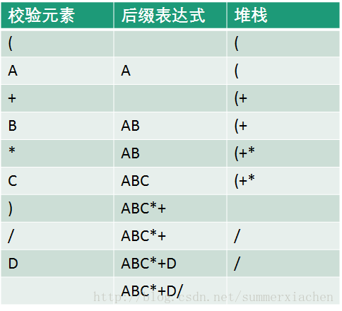

### **简化方法**

首先按照运算的先后顺序将表达式全部都添加上括号

`(a+b)*c*(d-e/f)----> (((a+b)*c)*((d-(e/f))))`

然后由于是后缀表达式，从里到外将所有运算符都拿到右括号的右边

`(((ab)+c)*((d(ef)/)-))*`

最后再将所有括号都去掉

`ab+c*def/-*`

同理，如果是变为前缀表达式的话，就把运算符拿到括号左边就可以啦

## **矩阵的行优先和列优先**

已知二维数组A[0..9,  0..9]中，元素`a[2][3]`的地址为400，每个元素占4个字节，则元素`a[6][5]`的地址为多少？

行优先: $400+4(10\times(6-2)+(5-3))$

列优先: $400+4((6-2)+10\times(5-3))$

## **树的基本性质**

性质1 树中的结点数等于所有结点的度数加1。

性质2 度为d的树中第i层上至多有 $d^{i}-1$ 个结点（i≥1）。

性质3 为k的d叉树至多有d^k^/d-1个结点。

性质4 具有n个结点的d叉树的最小深度为 $log_{d}{(n·(d-1)+1)}$

### **`二叉树性质`**

**性质1**：二叉树第i层上的结点数目最多为 **2^i-1^** (i≥1)。

*性质2：深度为k的二叉树至多有**2^k^-1**个结点(k≥1)。*

**性质3**：包含n个结点的二叉树的高度至少为**log~2~ (n+1)**。

**性质4**：在任意一棵二叉树中，若终端结点的个数为**n0**，度为2的结点数为**n2**，则**n0=n2+1**。

### **`完全二叉树性质`**

①$n=n0+n1+n2$   =>   $n=2n_{0}+n_{1}-1$

②$n=1+n_{1}+2n_{2}$

得出，若完全二叉树有ｎ个结点，n0=$\left \lceil n/2 \right \rceil$

设二叉树的深度为h，除第 h 层外，其它各层 (1～h-1) 的结点数都达到最大个数，第 h 层所有的结点都连续集中在最左边

具有 $n$ 个结点的完全二叉树的深度为 $\left \lceil \log_{2}{(ｎ+1)} \right \rceil$

结点 $i$ 所在的层次为 $\left \lfloor \log_{2}{i} \right \rfloor +1$

深度为 $k$，至少有 **$2^{k-1}$** 个节点，最多有 $2^{k}-1$ 个节点

### **满二叉树性质**

深度为k且有2^k^-1个结点

## **哈夫曼树(最优二叉树)的构造**

哈夫曼树并不唯一，但带权路径长度一定是相同的

1. 统计 每种字符出现的**频率**（也可以是概率）//权值
2. **(可以先排个序)**，每次找出字符中**最小的两个**（小在左，大在右，组成新二叉树），并求和(整体法) **塞回集合里**
3. 不断重复步骤2
4. 添加 0 和 1，规则 **左0右1**

### 每个 字符 的 二进制编码

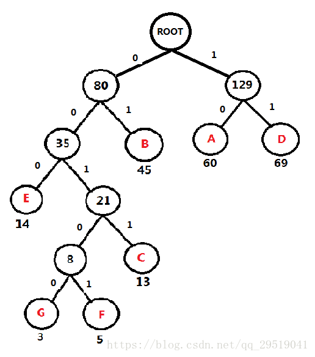

A：10
B：01
C：0011
D：11
E：000
F：00101
G：00100
那么当我想传送 ABC 时，编码为 10 01 0011

### **WPL（带权路径长度）**

**树中 所有叶子结点的 `路径长度*权值` 之和**

## **最小生成树**（针对无向图）

最小生成树（MST）：权值最小的生成树

构造网的最小生成树必须解决下面两个问题：

- 尽可能选取权值小的边，但不能构成回路；
- 选取n－1条恰当的边以连通n个顶点；

### **`普里姆算法（Prim算法）`**


### **克鲁斯卡尔算法**

**具体做法**：首先构造一个只含n个顶点的森林，然后**依权值从小到大从连通网中选择边**加入到森林中，并使森林中**不产生回路**，**直至森林变成一棵树**为止+


## **AOE网 关键路径（工期)**

即最大路径长度(权重)的路径，可能不止一条

> **相关术语**
> AOV网络（Activity On Vertex Network）：有向图，用顶点表示活动，用弧表示活动的先后顺序
> AOE网络（Activity On Edge）：有向图，用顶点表示事件，用弧表示活动，用权值表示活动消耗时 （带权的有向无环图）
> 活动：业务逻辑中的行为，用边表示
> 事件：活动的结果或者触发条件
> 关键路径：具有最大路径长度（权重）的路径，可能不止一条
> 活动的两个属性：e(i)最早开始时间，l(i)最晚开始时间
> 事件的两个属性：ve(j)最早开始时间，vl(j)最晚开始时间

**步骤：**

1. 先求出每个顶点的ve（最早开始时间）和vl（最晚开始时间）的值
2. 通过这两个值就可以求出每条边的e（最早开始时间）和 l（最晚开始时间）值。
3. 取e(i)=l(i)的边就是关键路径上的边，相连，就能得到关键路径（键路径可能不止一条）

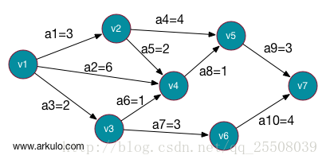

①：**求 $ve(j)$ 的值（事件最早开始时间）**
**从前向后**，直接前驱节点的ve值＋当前节点的边的权值（有可能多条，**`取最大值`**）
**第一个顶点的ve等于0**

> 用0来+

| 顶点  | V1    | V2  | V3  | V4  | V5  | V6  | V7  |
| ----- | ----- | --- | --- | --- | --- | --- | --- |
| ve(j) | **0** | 3   | 2   | 6   | 7   | 5   | 10  |

②：**求 $vl(j)$ 的值（事件最迟开始时间）**

> 从最后一个节点开始用10来 减去 前面的各个边(可能要累加) 的值 就能拿到每个点的vl(j)

**从后向前**（V9开始），直接后继节点的vl值－当前节点的边的权值（有可能多条，**`取最小值`**）
**终结点的vl等于它的ve**

| 顶点  | V1  | V2  | V3  | V4  | V5  | V6  | V7     |
| ----- | --- | --- | --- | --- | --- | --- | ------ |
| vl(j) | 0   | 3   | 3   | 6   | 7   | 6   | **10** |

③：**求 $e(i)$ 的值（活动最早开始时间）**

e ( i ): 活动ai是由弧< vk,vj >表示，则活动的最早开始时间应该和事件vk的最早发生时间相等
因此，就有$e(i)=ve(k)$

即：**边（活动）的最早开始时间等于它发出的顶点(事件)的的最早发生时间**

> 就是 每个箭头的 **起始点**

| 边   | a1(3) | a2(6) | a3(2) | a4(4) | a5(2) | a6(1) | a7(3) | a8(1) | a9(3) | a10(4) |
| ---- | ----- | ----- | ----- | ----- | ----- | ----- | ----- | ----- | ----- | ------ |
| e(i) | 0     | 0     | 0     | 3     | 3     | 2     | 2     | 6     | 6     | 7      |

④：**求 $l(i)$ 的值（活动最晚开始时间）**
l ( i )：活动ai是由弧< vk,vj >表示，则ai的最晚发生时间要保证vj的最迟发生时间不拖后（vj最迟发生时间为9的话，ai的最迟时间就必须是 9-活动耗时 ）。因此，$l(i)=vl(i)-len< v_{k},v_{j}>$
即：$边（活动）到达顶点的最晚发生时间  -  边的权重$

| 边   | a1(3) | a2(6) | a3(2) | a4(4) | a5(2) | a6(1) | a7(3) | a8(1) | a9(3) | a10(`4`) |
| ---- | ----- | ----- | ----- | ----- | ----- | ----- | ----- | ----- | ----- | -------- |
| e(i) | 0     | 0     | 1     | 3     | 4     | 5     | 3     | 6     | 7     | **6**    |

⑤：**求出关键边和关键路径**
当 `e(i)==l(i)`，即：活动最早开始时间 = 活动最晚开始时间时，可以得到 **关键边** 为： 
**a1  a2  a4  a8  a9**

然后 根据关键边组合成**关键路径**
**a1->a4->a9**  和  **a2->a8->a9**

## 构造哈希函数的方法

### 直接定址法

**取关键字的某个线性函数为散列地址，Hash（Key）=Key 或 Hash（Key）= A*Key+B**

利用数组下标可以很好的将对应的数据存入哈希表对应的位置。例如：在一个字符串中找出第一次只出现一次的字符，字符串为abcdabcdefg，需要找到e，利用下标统计可以很好地解决这个问题，对于这个问题，你必须开辟对应的256个空间。如果需要查找的数中出现了一个特别大的数（1000000），你必须要开辟1000000个空间，会造成大量空间的浪费。

### 除留余数法

**取关键值被某个不大于散列表长m的数p除后的所得的余数为散列地址。Hash（Key）= Key % P**

由于“直接定址法”的缺陷，于是下面引入“除留余数法”，该方法提高的空间的利用率，但不同的Key值经过哈希函数Hash(Key)处理以后可能产生相同的值哈希地址，我们称这种情况为哈希冲突。任意的散列函数都不能避免产生冲突。

## **处理哈希冲突的闭散列方法**

**哈希表的装填因子**

$装填因子 = （哈希表中的记录数） /（哈希表的长度）$

装填因子是哈希表装满程度的标记因子。值越大，填入表中的数据元素越多，产生冲突的可能性越大。

### 线性探测

直接使用数组来存储数据。可以想象成一个停车问题。若当前车位已经有车，则你就继续往前开，直到找到下一个为空的车位

`1, 2, 3, 4, 5 ... ...`


> 这种多个哈希地址不同的关键字争夺同一个后继哈希地址的现象称为“聚集”。聚集对查找效率有很大影响

### 二次探测

**`±1, ±4, ±9 ... ...`**

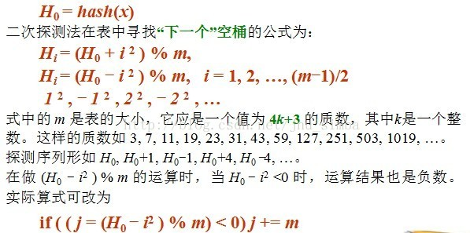

> 二次探测能有效避免“聚集”现象，但是不能够探测到哈希表上所有的存储单元，但是至少能够探测到一半。

### 链地址法(拉链法)

拉链法 的实现比较简单，将链表和数组相结合。也就是说创建一个链表数组，数组中每一格就是一个链表。若遇到哈希冲突，则将冲突的值加到链表中即可

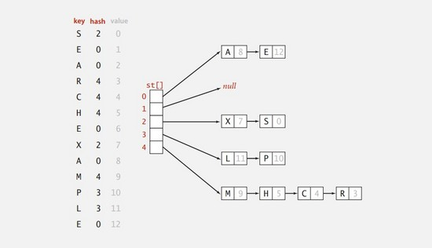

对于 `线性探测` 来说动态调整数组大小是必要的，不然会产生死循环。

`拉链法` 的删除操作比较方便，直接链表修改地址即可。而 `线性探测` 删除操作很复杂，而且 `线性探测` 耗费的内存比拉链法要多

由于哈希表高效的特性，查找或者插入的情况在大多数情况下可以达到O(1)，时间主要花在计算hash上，当然也有最坏的情况就是hash值全都映射到同一个地址上，这样哈希表就会退化成链表，查找的时间复杂度变成O(n)

https://blog.csdn.net/SnailMann/article/details/80435311

https://blog.csdn.net/u011240877/article/details/52940469

https://www.cnblogs.com/s-b-b/p/6208565.html

### 不同处理冲突方法的ASL(平均查找长度)

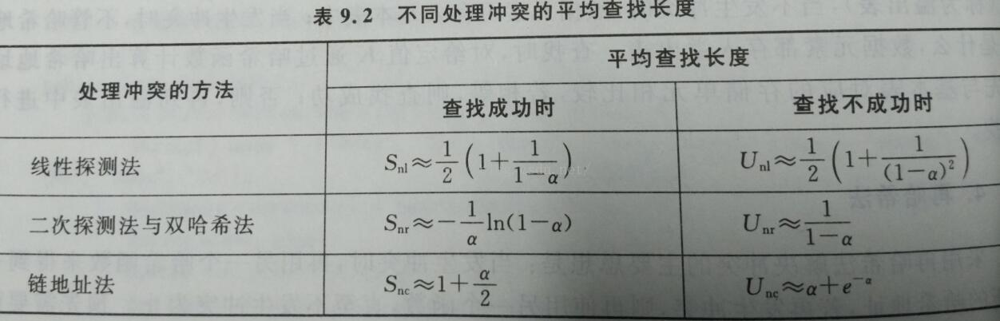

## **Hash表的“查找成功的ASL”和“查找不成功的ASL”**

*ASL指的是 平均查找时间*

**关键字序列**：（7、8、30、11、18、9、14）

**散列函数：** 
H(Key) = (key x 3) MOD 7

**装载因子：** 
0.7

**处理冲突**：线性探测再散列法

---

### **查找成功的ASL计算方法：**

因为现在的数据是7个，填充因子是0.7。所以数组大小=7/0.7=10，即写出来的散列表大小为10，下标从0~9。 
第一个元素7，带入散列函数，计算得0。 
第二个元素8，带入散列函数，计算得3。 
第三个元素30，带入散列函数，计算得6。 
第四个元素11，带入散列函数，计算得5。 
第五个元素18，带入散列函数，计算得5；此时和11冲突，使用线性探测法，得7。 
第六个元素9，带入散列函数，计算得6；此时和30冲突，使用线性探测法，得8。 
第七个元素14，带入散列函数，计算得0；此时和7冲突，使用线性探测法，得1。 
所以**散列表**：

| 地址    | 0   | 1   | 2   | 3   | 4   | 5   | 6   | 7   | 8   | 9   |
| ------- | --- | --- | --- | --- | --- | --- | --- | --- | --- | --- |
| **key** | 7   | 14  |     | 8   |     | 11  | 30  | 18  | 9   |     |

所以查找成功的计算： 
如果查找7，则需要查找1次。 
如果查找8，则需要查找1次。 
如果查找30，则需要查找1次。 
如果查找11，则需要查找1次。 
如果查找18，则需要查找3次：第一次查找地址5，第二次查找地址6，第三次查找地址7，查找成功。 
如果查找9，则需要查找3次：第一次查找地址6，第二次查找地址7，第三次查找地址8，查找成功。 
如果查找地址14，则需要查找2次：第一次查找地址0，第二次查找地址1，查找成功。 
所以，**ASL=（1+2+1+1+1+3+3）/ 7=12/ 7**

---

### **查找不成功的ASL计算方法：**

> 鉴于网络上有各种版本，本人认为此种计算方法比较合理。验证实例可以参考2010年的计算机408考研真题的第一道计算大题和答案。

**1. 定义什么叫查找不成功** 
举个例子来说吧。在已知上面散列表的基础上，如果要查找**key为4**的关键字。根据散列函数可以计算Hash(key)=Hash(4)=5。此时在地址为5的地方取出那个数字，发现key=11，不等于4。这就说明在装填的时候会发生冲突。根据冲突处理方法，会继续检测地址为6的值，发现key=30，依然不等。这个时候到了**地址为6**，但是**依然没有找到**。那么就说明根本就没有key=4这个关键字，**说明本次查找不成功。**注意：为什么到地址6？因为散列函数中有 mod7 ，对应的地址为0\~6，即0\~6查找失败的查找次数。 
再举一个例子。查找**key为0**的关键字，根据散列函数可以计算Hash(key)=Hash(0)=0。此时在地址为0的地方取出那个数字，发现key=7，不等于0。这就说明在装填的时候会发生冲突。根据冲突处理方法，会继续检测地址为1的值，发现key=14，依然不等。这个时候到了**地址为3，发现为空**，**依然没有找到**。所以停止查找，**本次查找不成功。**因为如果key=0这个关键字存在的话，依照冲突处理函数，就一定能找到它。总不能丢了吧。

**2. 根据第一点定义的不成功，依次推下去：** 
查找地址为0的值所需要的次数为3， 
查找地址为1的值所需要的次数为2， 
查找地址为2的值所需要的次数为1， 
查找地址为3的值所需要的次数为2， 
查找地址为4的值所需要的次数为1， 
查找地址为5的值所需要的次数为5， 
查找地址为6的值所需要的次数为4。 
**3.计算** 
查找不成功ASL=（3+2+1+2+1+5+4）/ 7=18/ 7

---

链地址法

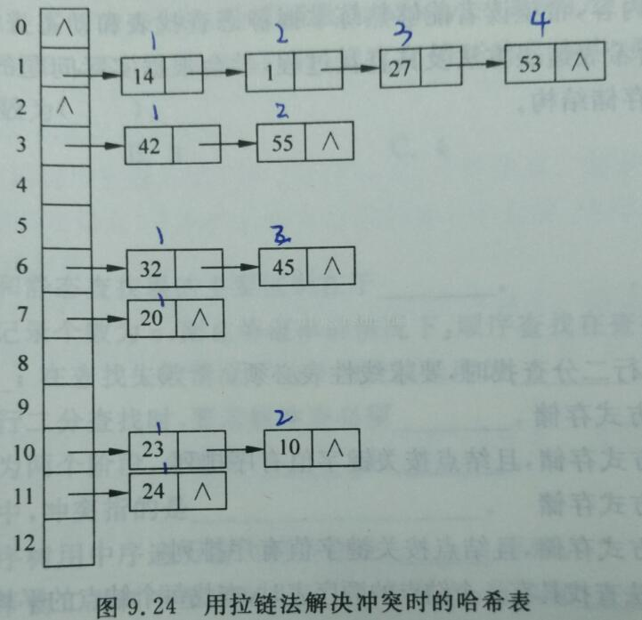

查找成功时的平均查找长度：

ASL = (1*6+2*4+3*1+4*1)/**12** = 7/4

查找不成功时的平均查找长度：

ASL = (4+2+2+1+2+1)/**13**

注意：查找成功时，分母为 `哈希表元素个数`，查找不成功时，分母为 `哈希表长度`

## 希尔排序(缩小增量排序)


## 堆排序

**步骤：**

1. 将一个无序序列构造成堆(算完全二叉树的一种) ：**大顶堆(升序)(父节点大于孩子节点)**  **小顶堆(降序)**
2. 不断地   **交换数组首尾元素+拿掉最大(尾)元素+再调整堆**

步骤二 将堆顶元素与末尾元素进行交换，使末尾元素最大。然后继续调整堆，再将堆顶元素与末尾元素交换，得到第二大元素。如此反复进行交换、重建、交换。

a.将堆顶元素9和末尾元素4进行交换

这里，必须说明一下，**所谓的交换，实际上就是把最大值从树里面拿掉了**，剩下参与到排序的树，其实只有总结点的个数减去拿掉的节点个数了。所以图中用的是虚线。


b.重新调整结构，使其继续满足堆定义


c.再将堆顶元素8与末尾元素5进行交换，得到第二大元素8.


后续过程，继续进行调整，交换，如此反复进行，最终使得整个序列有序


https://blog.csdn.net/u013384984/article/details/79496052

https://www.cnblogs.com/chengxiao/p/6129630.html

我们称这个自堆顶至叶子的调整过程为“筛选”。
从无序序列建立堆的过程就是一个反复“筛选”的过程。

初始化堆的时候是对所有的非叶子结点进行筛选。

最后一个非终端元素的下标是$\left \lfloor n/2 \right \rfloor$，所以筛选只需要从第$\left \lfloor n/2 \right \rfloor$个元素开始，从后往前进行调整。

## 以xx为枢轴的一趟快速排序

**三数取中**

　　在快排的过程中，每一次我们要取一个元素作为枢纽值，以这个数字来将序列划分为两部分。在此我们采用三数取中法，也就是取左端、中间、右端三个数，然后进行排序，将中间数作为枢纽值。


**根据枢纽值进行分割**


### EXP

1. 选枢轴
2. **枢轴在左** 就**从右先**  扫描 **比它小的**，然后再从左 扫大的，然后**交换**
3. **直到 ** **碰撞**，就**交换 碰撞位置和枢轴**

## 森林、二叉树、树 相互转换

### 森林转二叉树

所有孩子结点**串成链表**(右子树代表**同层**的) 放在 **左子树**(左子树代表有孩子结点)

然后把森林从左到右 连右结点

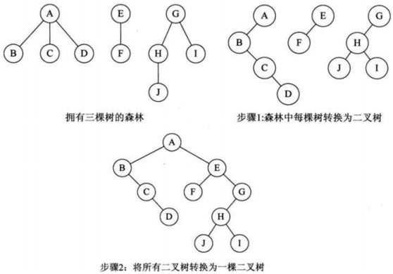

### 树转二叉树

1. 加线。在所有的兄弟结点之间加一条线（**同层加线**）
2. 去线。树中的每个结点，**只保留它与第一个孩子结点的连线**，删除其他孩子结点之间的连线。
3. 调整。以树的根结点为轴心，将整个树调节一下（第一个孩子是结点的左孩子，兄弟转过来的孩子是结点的右孩子）（**往右旋转一下图片**）

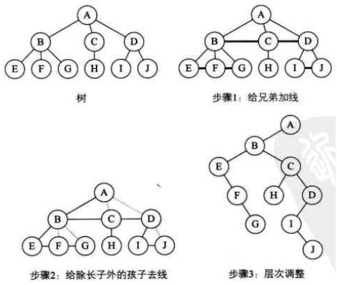

### 二叉树转树

其实就是还原上面提到的步骤

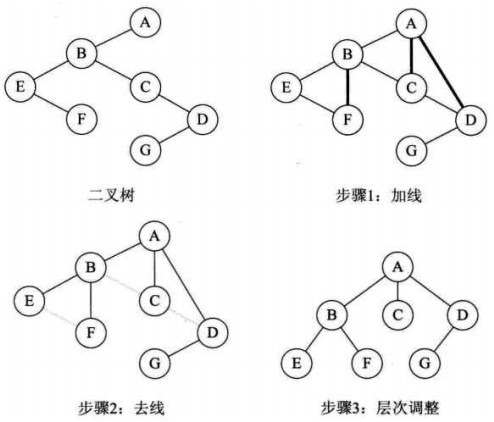

### 二叉树转森林

**前提**：加入一棵**二叉树的根节点有右孩子**，则这棵二叉树能够转换为森林，**否则转换为一棵树**

转换规则：

1. 从**根节点**开始，若右孩子存在，则**把与右孩子结点的连线删除**。再查看分离后的二叉树，若其根节点的右孩子存在，则连续删除。直到所有这些根结点与右孩子的连线都删除为止。
2. 将**每棵**分离后的**二叉树转换为树**。

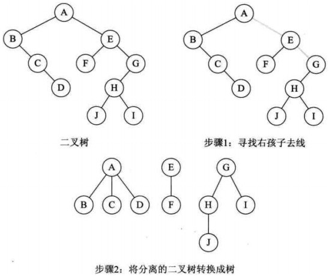

## 二叉查找树(BST)（折半查找）

> 二叉排序树或者是一棵空树，或者是具有下列性质的[二叉树](https://baike.baidu.com/item/%E4%BA%8C%E5%8F%89%E6%A0%91)：
>
> （1）若左子树不空，则左子树上所有结点的值均小于它的[根结](https://baike.baidu.com/item/%E6%A0%B9%E7%BB%93)点的值；
>
> （2）若右子树不空，则右子树上所有结点的值均大于它的根结点的值；
>
> （3）左、右子树也分别为二叉排序树；
>
> （4）没有键值相等的节点。

假设得到的**中序序列是有序的**。则说明这棵二叉树是二叉排序树

反过来，折半查找 被查找的数组的元素，**必须是有序排列的**

### 二叉平衡树

平衡二叉树又称AVL树。它或者是颗空树，或者是具有下列性质的二叉树：它的左子树和右子树都是平衡二叉树，且左子树和右子树的深度之差的绝对值不超过1

### ASL(平均查找长度)  查找成功

**`每个结点的深度相加除以结点个数`**

最坏情况（深度为N的单支树）  为 $ \frac{N+1}{2}$ （也就是最大值）
最好情况（形态均匀、满二叉树）      和折半查找一样大约为 $log_{2}{N}$   =log2（n+1）-1
PS：若构造完成,例：   则平均查找长度为：(1×1+2×2+3×4+4×3)/**10**=2.9
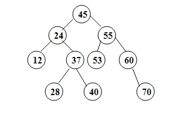

### ASL(平均查找长度)  查找不成功

**查找到`外部节点`时表示查找失败**，**`外部节点比判定树节点个数多1个`**

折半查找的最坏性能与平均性能相当接近，其时间复杂度是O(log n)

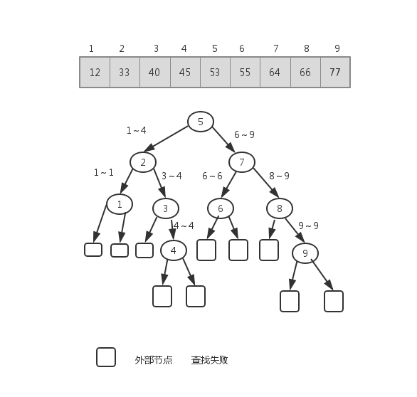

图例查找失败时的ASL=1/10*(3*6+4*4)=17/5

### **折半查找原理**

1. 在查找前对数组进行折半操作 （初始化指针位置）
   $折半公式= (最大索引+最小索引)/2$
   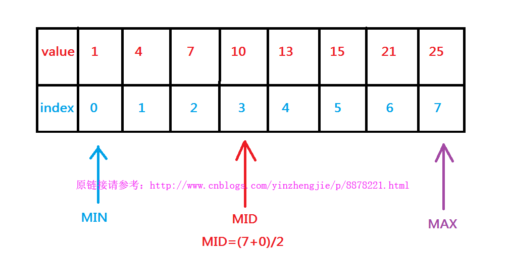
2. 折半后的指针索引和被查找元素比较
   若被查找元素的值（12）**大于中间索引上的值**（10），我们就把**最小值指针（MIN）移动到中间指针(MID)索引的下一个索引位置**
   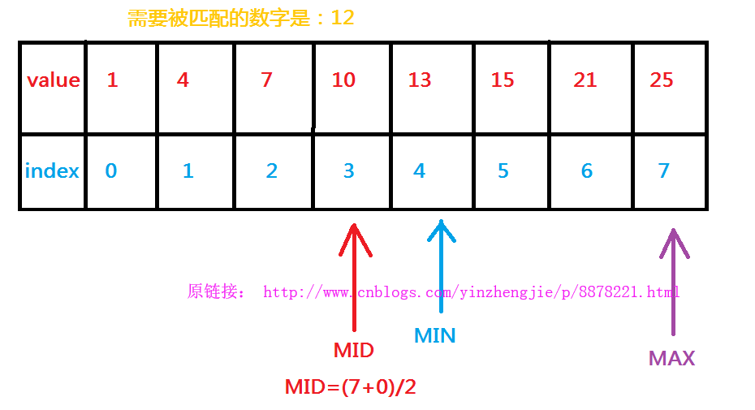
3. 若没有匹配到就继续折半后的指针索引和被查找元素比较
   
   若被查找元素的值（12）**小于中间索引上的值**（15），我们就**把最大值指针（MAX）移动到中间指针(MID)索引的上一个索引位置**
   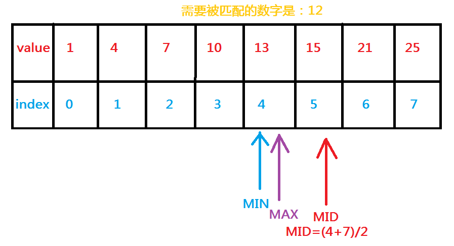
4. 若没有匹配到就继续折半后的指针索引和被查找元素比较。 
   若被查找元素的值（12）小于中间索引上的值（13），我们就把最大值指针（MAX）移动到中间指针(MID)索引的上一个索引位置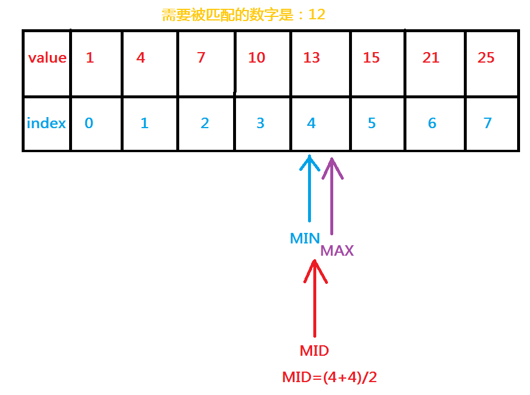
5. 若没有匹配到就继续折半后的指针索引和被查找元素比较。 
   **当小指针(MIN)的索引(4)超过了大指针(MAX)的索引(3)时，就需要停止查找了**，如果真有这种情况发生，**说明没有查到**被查找元素的值（12），此时会返回一个负数（-1）,当然如果查找到了就返回其在数组中的索引即可

## 图的性质

度（Degree）：一个顶点的度是指与该顶点相关联的边的条数，顶点v的度记作d(v)。

入度（In-degree）和出度（Out-degree）：对于有向图来说，一个顶点的度可细分为入度和出度。一个顶点的入度是指与其关联的各边之中，以其为终点的边数；出度则是相对的概念，指以该顶点为起点的边数。

### 强连通图的性质

有 $n$ 个顶点的强连通图 最多有 $n(n-1)$ 条边，最少有 $n$ 条边

> 有向图： **`强连通性`** 
>
>    具有7个顶点的有向图至少应有多少条**边**才可能成为一个强连通图?           7         key: n 
>
>    问题同：已知一个有向图具有7个顶点，且是一个强联通图，问至少多少条**弧**？             7         key: n 
>
>    具有7个顶点的有向图至少应有多少条边一定成为一个强连通图?              37       key: (n-1)(n-1) + 1 
>
>    已知一个有向图具有7个顶点，且是一个强联通图，问**至多 多少条弧**？        42         key: (n-1)*n 
>
>
>
> 无向图：**``连通性``** 
>
>    具有7个顶点的**无向图**至少应有多少条边才可能成为一个连通图?            6           key:  **`n-1`** 
>
>    问题同：已知一个**无向图**具有7个顶点，且是一个连通图，问至少多少条边？            6              key: n-1   
>
>    具有7个顶点的无向图至少应有多少条边一定成为一个连通图?                16       key:(n-1)(n-2)/2 + 1   
>
>    已知一个有向图具有7个顶点，且是一个强联通图，问至多 多少条弧？          21         key:   **`(n-1)*n /2`**

## 稳定排序与不稳定排序

如果排序结束后，a[0]可以保证一定在a[3]前头，也就是他们**原有的顺序不变**，那这种排序算法就是**稳定的**。（比如常见的冒泡排序、基数排序、插入排序、归并排序、桶排序、二叉树排序等都是稳定的排序算法）
反之，如果不能保证原有顺序，这种算法就是**不稳定的**

基数排序、冒泡排序、直接插入排序、折半插入排序、归并排序  是  **稳定的排序算法**
**快速**排序、**希尔**排序、**堆**排序、**直接选择**排序  是  **`不稳定` 的排序算法**。

## 图的搜索

DFS 类似 树的 先序遍历

### **无向图的深度优先搜索**


**第1步**：访问A。 
**第2步**：访问(A的邻接点)C。 
​    在第1步访问A之后，接下来应该访问的是A的邻接点，即"C,D,F"中的一个。但在本文的实现中，顶点ABCDEFG是按照顺序存储，C在"D和F"的前面，因此，先访问C。 
**第3步**：访问(C的邻接点)B。 
​    在第2步访问C之后，接下来应该访问C的邻接点，即"B和D"中一个(A已经被访问过，就不算在内)。而由于B在D之前，先访问B。 
**第4步**：访问(C的邻接点)D。 
​    在第3步访问了C的邻接点B之后，B没有未被访问的邻接点；因此，返回到访问C的另一个邻接点D。 
**第5步**：访问(A的邻接点)F。 
​    前面已经访问了A，并且访问完了"A的邻接点B的所有邻接点(包括递归的邻接点在内)"；因此，此时返回到访问A的另一个邻接点F。 
**第6步**：访问(F的邻接点)G。 
**第7步**：访问(G的邻接点)E。

因此访问顺序是：**A -> C -> B -> D -> F -> G -> E**

### **有向图的深度优先搜索**


**第1步**：访问A。 
**第2步**：访问B。 
​    在访问了A之后，接下来应该访问的是A的出边的另一个顶点，即顶点B。 
**第3步**：访问C。 
​    在访问了B之后，接下来应该访问的是B的出边的另一个顶点，即顶点C,E,F。在本文实现的图中，顶点ABCDEFG按照顺序存储，因此先访问C。 
**第4步**：访问E。 
​    接下来访问C的出边的另一个顶点，即顶点E。 
**第5步**：访问D。 
​    接下来访问E的出边的另一个顶点，即顶点B,D。顶点B已经被访问过，因此访问顶点D。 
**第6步**：访问F。 
​    接下应该回溯"访问A的出边的另一个顶点F"。 
**第7步**：访问G。

因此访问顺序是：**A -> B -> C -> E -> D -> F -> G**


### **无向图的广度优先搜索**


**第1步**：访问A。 
**第2步**：依次访问C,D,F。 
​    在访问了A之后，接下来访问A的邻接点。前面已经说过，在本文实现中，顶点ABCDEFG按照顺序存储的，C在"D和F"的前面，因此，先访问C。再访问完C之后，再依次访问D,F。 
**第3步**：依次访问B,G。 
​    在第2步访问完C,D,F之后，再依次访问它们的邻接点。首先访问C的邻接点B，再访问F的邻接点G。 
**第4步**：访问E。 
​    在第3步访问完B,G之后，再依次访问它们的邻接点。只有G有邻接点E，因此访问G的邻接点E。

因此访问顺序是：**A -> C -> D -> F -> B -> G -> E**

### **有向图的广度优先搜索**


**第1步**：访问A。 
**第2步**：访问B。 
**第3步**：依次访问C,E,F。 
​    在访问了B之后，接下来访问B的出边的另一个顶点，即C,E,F。前面已经说过，在本文实现中，顶点ABCDEFG按照顺序存储的，因此会先访问C，再依次访问E,F。 
**第4步**：依次访问D,G。 
​    在访问完C,E,F之后，再依次访问它们的出边的另一个顶点。还是按照C,E,F的顺序访问，C的已经全部访问过了，那么就只剩下E,F；先访问E的邻接点D，再访问F的邻接点G。

因此访问顺序是：**A -> B -> C -> E -> F -> D -> G**


## 【题目】

1. 设森林F中有三棵树,第一、第二、第三棵树的结点个数分别为 $M1, M2, M3$
   与森林F对应的二叉树根结点的右子树上的结点个数是 $M2+M3$
2. 在的情况下，查找成功的ASL是最大的，查找成功的ASL最大是（n+1）/2
3. 哈希表ASL https://blog.csdn.net/u013806583/article/details/52643541
4. 线性表的特点是每个元素都有一个前驱和一个后继   错   开头和结尾
5. 单循环链表，p指针指向链尾节点的条件是  p->next = head
6. 冒泡排序算法在最好情况下的时间复杂度是O(N)      虽然平时都是N2   但是里面那个循环的若干次的交换   没了     有序表    不就是N了吗                      优化算法：如果发生了交换就1  没交换就0
7. 用**邻接矩阵法**存储一个**图所需的存储单元数目**与**图的点数**有关
8. 设某无向图中顶点数和边数分别为 n 和 e ，所有顶点的度数之和为 d ，则 e=d/2
   无向图中的度的定义是：出度+入度=图的度数，故边数为度数的一半
9. 在有向图G的拓扑序列中，若顶点Vi在顶点Vj之前，则下列情形不可能出现的是（）。
   G中有弧<Vi，Vj>
   G中有一条从Vi到Vj的路径
   G中没有弧<Vi,Vj>
   ~~**G中有一条从Vj到Vi的路径**~~
   拓扑排序采用栈的方式，如果一个顶点在另一个顶点之前，那么就已经出栈，而且被删除了
   ​          形成了环，就已经不是拓扑排序了
